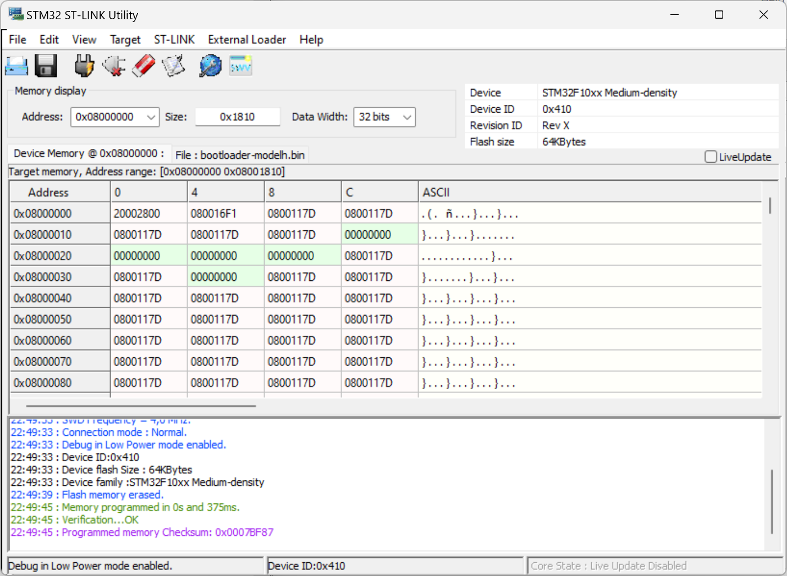

# **Model H Remix**
## Replacement Model M controller board

  
This board is a direct replacement controller for the classic IBM Model M keyboards. 
Old mechanical keyboards are making a comeback among enthusiasts and programmers and gaining value. 
Unfortunately, modern computers no longer have DIN or PS2 ports, so there’s no simple way to connect a 40-year-old hardware to a brand-new laptop. 
By replacing the legacy electronics inside the keyboard, it’s possible to revive a “piece of history” and even add modern functions like USB connectivity, wireless support, and remappable characters. The original PCB can be preserved to revert the keyboard to its original state. 

The "Model H Remix" is designed to fit and work with standard 101/102 keys keyboards. 

## **Hardware**
Still work in progress.

## **Software**

### **DFU Program**
- Attach a ST-LINK v2 programmer to the Debug connector. Only the 3 wires shows in the pic are needed. ST-LINK pinout are indicated normally on the side of the programmer 

- Power supply the board with a USB cable; 

  >NOTE: USB cable must be connected to the PC where the ST Link is attached to, NOT to a power supply! GND between Model H and ST-LINK must be common. 
 
- Use the "STM32-ST LINK Utility" program 
 
Select: 
  - Target -> Connect ;
  - Target -> Erase Chip ;
  - File -> Open -> “bootloader-modelh.bin” ;
  - Target -> Program & Verify ;

### **Software Upload**
#### FLASH SOFTWARE PREPARATION
1)	Download lates DFU-utility from following site: https://dfu-util.sourceforge.net/
    >Al momento della stesura di questa procedura la versione è la seguente: https://dfu-util.sourceforge.net/releases/dfu-util-0.11-binaries.tar.xz
2)	Once donwloaded, unpack it somewhere (for example on the Desktop);
3)	Createa new folder “Firmware” on the Desktop;
4)	Copy in the “Firmware” folder the content of the  folder “dfu-util-0.11-binaries\win64”;
    >In case of 32bit Windows, pick the conetent of the “win32” fodler
5)	Copy in this location also the .bin file that you want to upload on the board, in this example the .bin file is “ibm_modelh_iso_vial.bin”;

#### FLASH OF .BIN FILE IN THE MODELH CONTROLLER
1)	Open a Command Promt: press WINDOWS+R adn type "CMD" + Enter;
2)  Move to "Desktop\Firmware" by typing 
cd Desktop\Firmware
3)	Put the Model H controller in DFU mode (Programming) by eigther:
    - Unconnect and reconnect the USB Cable while holding the ESC key pressed (if it's mounted inside a keyboard);
    -	By pressing the Reset tactile button on the board, if it's reachable;
 
4) Launch DFU writing utility by typing 
dfu-util.exe -D ibm_modelh_iso_vial.bin

## **Credits**  

This version is just a rework of the original design from **John Hawthorn**.  
Check out the fantastic work of this guy to whom I am very grateful. Thanks to his Open Source project I really learned a lot.  [Model H Project](https://modelh.club/)  

